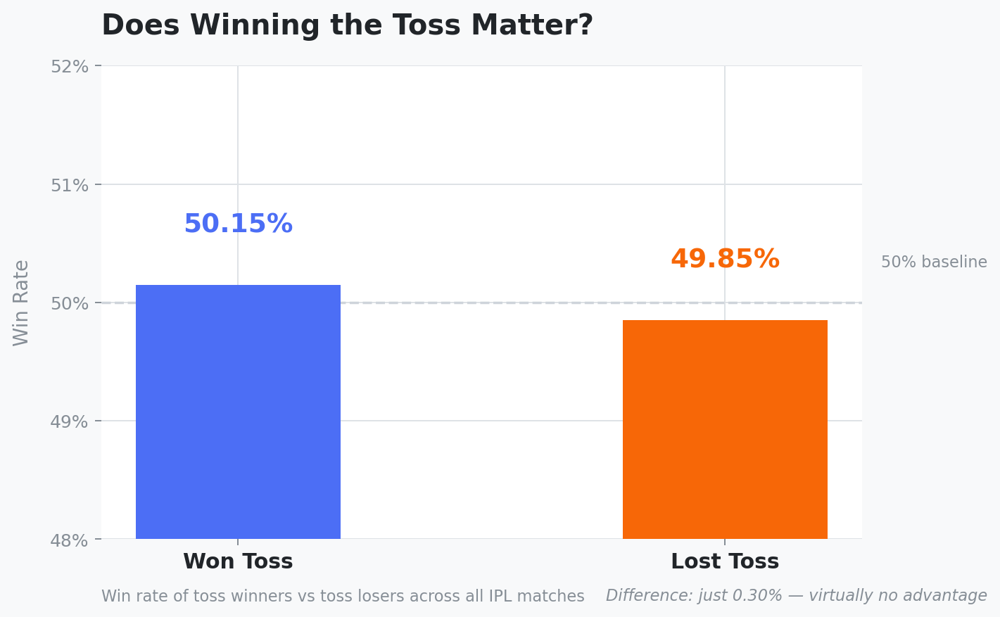
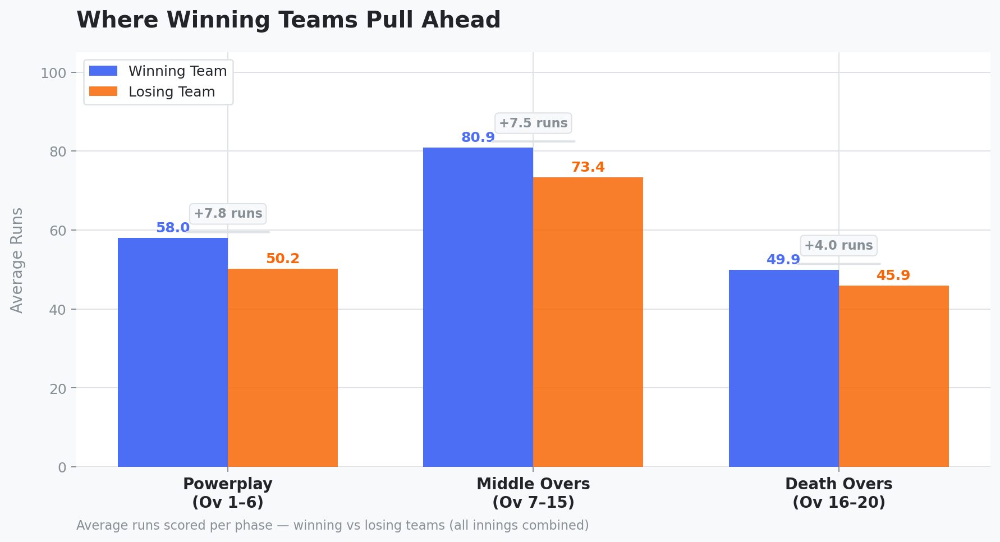
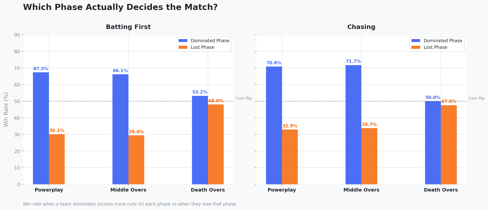
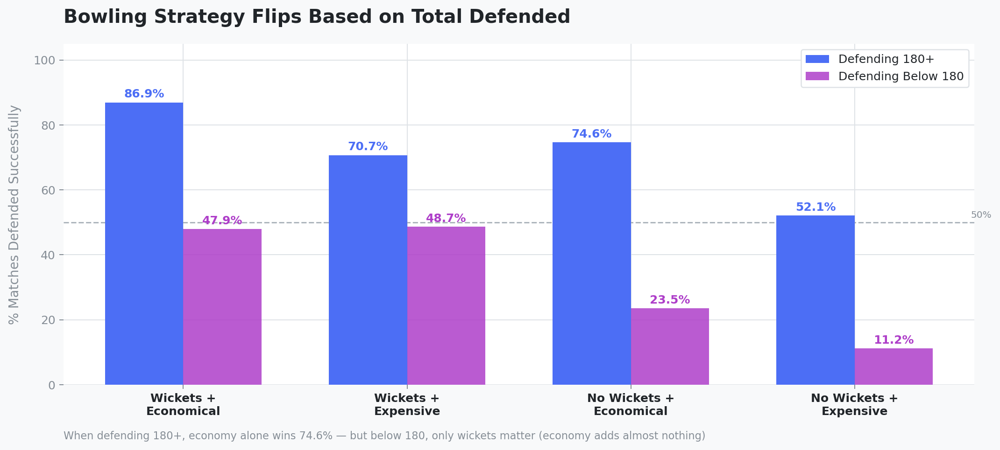

# 🏏 IPL Crunch '26 — Data Analysis Challenge


> Ball-by-ball IPL data analysis uncovering what actually wins matches — not what fans assume.

Submitted for **IPL Crunch '26** by Wooble — an online data analytics challenge where participants analyze real IPL match datasets to uncover patterns, answer high-impact cricket questions, and present insights through charts, analysis, and storytelling.

---

## 💡 Surprise Finding

> *"Dominating the Death Overs gives teams just a 5.2% edge — barely better than a coin flip. Despite being the most talked-about phase in T20 cricket, Death Over dominance is 7x less predictive than Powerplay dominance (67.3% win rate). Matches are decided quietly in the first 15 overs, not in the dramatic finish."*

---

## 📌 Key Findings

| # | Question | Finding |
|---|---|---|
| 1 | Does winning the toss matter? | Toss winners win just 50.15% of matches — a 0.3% edge, effectively random |
| 2 | Which phase impacts victory most? | Powerplay dominance predicts winning 67.3% of the time — Death Overs just 53.2% |
| 3 | What do winning teams do differently? | When chasing, winners lose 1.61 wickets in the Powerplay vs 2.46 for losers |
| 4 | Economy vs Wickets when defending? | Defending 180+: economy edges wickets. Below 180: only wickets matter |
| 5 | What happens after 3 dot balls? | Another dot ball (43.7%) — not a wicket or boundary as fans expect |

---

## 📊 Visualizations

### Toss Impact


### Average Runs Per Phase — Winners vs Losers


### Phase Dominance Win Rate


### Bowling Strategy by Total Defended


---

## 🗂️ Repository Structure

IPL-Crunch-26/
│
├── data/                          # IPL ball-by-ball dataset
├── notebooks/
│   ├── IPL_Crunch_26_Analysis.ipynb   # Full analysis — all 5 findings
│   └── IPL_Visuals.ipynb              # All chart generation code
├── visuals/                       # exported charts (PNG)
└── report/                        # Final PDF submission report


---

## 🔍 Methodology

- **Dataset**: Ball-by-ball IPL data across multiple seasons (~500k+ deliveries)
- **Tools**: Python (Pandas, NumPy, Matplotlib), SQL, Excel, Tableau, Jupyter
- **Analysis approach**:
  1. Segmented every delivery into phases (Powerplay / Middle / Death)
  2. Built phase dominance tables split by innings (batting first vs chasing)
  3. Correlated phase-level run rate and wickets against match outcomes
  4. Analyzed bowling performance (economy vs wickets) by total defended
  5. Built ball-by-ball pressure sequences to study dot ball behavior

---

## 📋 Analysis Breakdown

### 1 — Toss Analysis
Calculated win rate for toss winners vs losers across all matches. Finding: 0.3% difference — winning the toss has no meaningful impact on match outcome.

### 2 — Phase Impact
For each match, identified which team dominated each phase (scored more runs). Measured win rate when dominating Powerplay, Middle Overs, and Death Overs — split by innings.

**Key numbers:**
- Powerplay dominated → win 67.3% (batting first) / 70.8% (chasing)
- Middle Overs dominated → win 66.1% (batting first) / 71.7% (chasing)
- Death Overs dominated → win 53.2% (batting first) / 50.0% (chasing)

### 3 — Batting Strategy
Analyzed average wickets lost and run rate per phase for winning vs losing teams, split by innings. Found that Powerplay wicket preservation is the single biggest differentiator between winners and losers when chasing.

### 4 — Bowling Strategy
Classified bowlers as wicket-taking (2+ wickets) and economical (≤9 economy) when defending 180+ vs below 180. The strategy completely flips:
- **Defending 180+**: Economical bowler with no wickets wins 74.6% — economy is paramount
- **Defending below 180**: Wicket-taker wins 48.7% vs economical no-wicket-taker at 23.5% — wickets are everything

### 5 — Dot Ball Pressure
Tracked sequences of 3+ consecutive dot balls and measured the outcome of the next delivery. Compared against baseline delivery outcomes. Found that pressure breeds more pressure — not wickets.

---

## 🛠️ How to Run

```bash
# Install dependencies
pip install pandas numpy matplotlib jupyter

# Launch analysis notebook
jupyter notebook notebooks/IPL_Crunch_26_Analysis.ipynb

# Launch visuals notebook
jupyter notebook notebooks/IPL_Visuals.ipynb
```

---

## 📁 Dataset

Dataset sourced from the IPL Crunch '26 challenge resources provided by Wooble.
Original data available at: [Cricsheet.org](https://cricsheet.org)

---

*Built for IPL Crunch '26 — Wooble Data Analytics Challenge*
